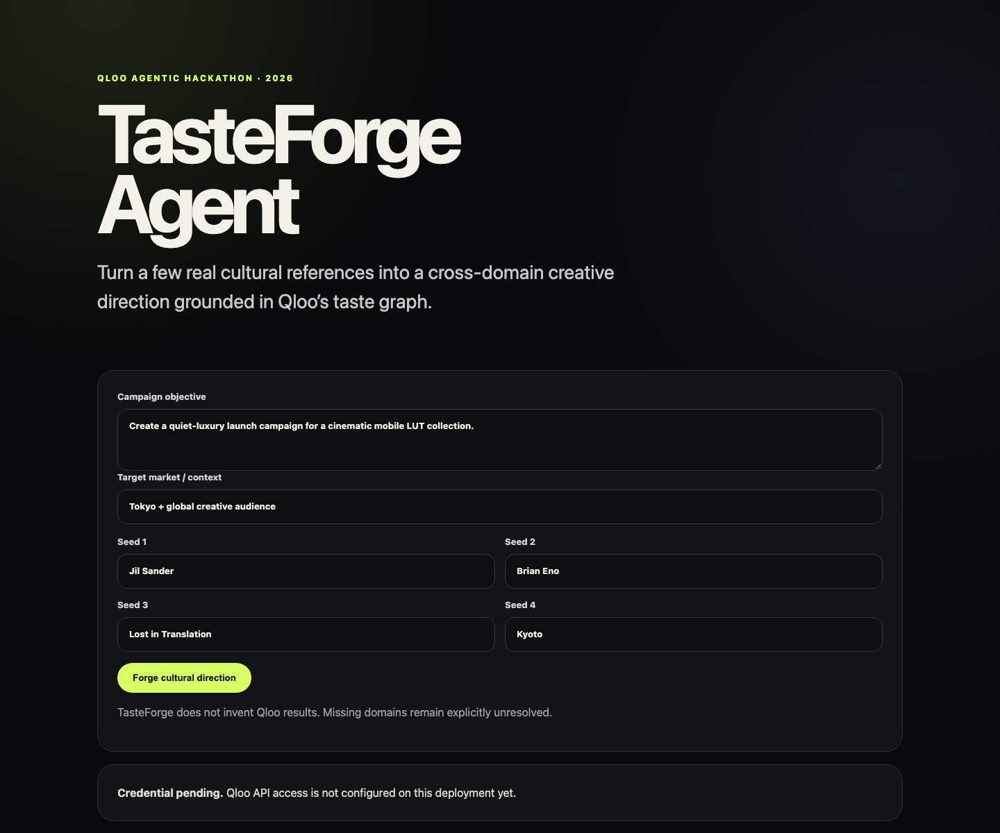

# TasteForge Agent — submission dossier

## Problem

Generic LLMs can write plausible creative briefs, but plausibility is not cultural evidence.
A creator or brand still has to guess whether a proposed film, artist, brand, or place actually belongs near the audience taste they are targeting.

TasteForge turns that problem into an evidence-bearing Qloo agent workflow.

## Product flow

1. Human supplies 2–4 cultural seeds and a campaign objective.
2. Official Qloo `describe` resolves each seed.
3. At least two resolved seeds are required before synthesis.
4. Official Qloo `entity_tags` extracts cultural concepts shared by the seeds.
5. Official Qloo `recommend` queries adjacent brands, movies, artists, and places.
6. TasteForge normalizes the returned evidence.
7. The creative brief is synthesized only from returned Qloo results.
8. Every operation stays visible with status, correlation ID, duration, warnings, and provenance.
9. Missing/failed workflows remain missing instead of being replaced by model guesses.

## Qloo surface

Pinned runtime:

- `@qloo/qloo-harness@0.1.26`
- workflow contract `1.0.0`
- result schema `1.0-preview.1`
- endpoint `https://hackathon.api.qloo.com`
- fallback `none`

The application does not silently switch to another transport after Qloo failure.

## Demo media

Current credential-safe UI screenshot:



The screenshot intentionally shows the credential-pending state. It contains no API key, personal data, or fabricated Qloo result. A second result-state screenshot/video will be captured only after the real event key produces a live Qloo run.

## Demo flow

Suggested example:

- Objective: quiet-luxury campaign for a cinematic mobile LUT collection.
- Seeds: Jil Sander, Brian Eno, Lost in Translation, Kyoto.
- Market: Tokyo + global creative audience.
- Output: cultural tags + cross-domain taste map + campaign moves + exact Qloo workflow trace.

## Architecture

```text
browser
  |
POST /api/forge
  |
validateInput
  |
official @qloo/qloo-harness executor
  |-- describe(seed) x 2–4
  |-- entity_tags(all seeds)
  |-- recommend(brand)
  |-- recommend(movie)
  |-- recommend(artist)
  '-- recommend(place)
  |
versioned Qloo result envelopes
  |-- status
  |-- correlation id
  |-- warnings
  '-- provenance
  |
evidence-only synthesis
  |
brief + normalized evidence + trace
```

## Responsible data handling

- No personal data is requested or sent to Qloo.
- API key is server-side only.
- Seeds/objective/market are length-bounded.
- Failed Qloo workflows are explicit in the trace.
- No database is required and the MVP does not persist user prompts/results.
- Qloo response evidence and TasteForge synthesis are visually separated.

## Known limitations

- Qloo results describe group-level taste relationships; they do not predict an individual person's behavior.
- TasteForge only synthesizes the domains returned by the official Qloo workflows; an empty or failed domain remains unresolved.
- Seed resolution can be ambiguous when a short name maps to multiple cultural entities.
- The current brief is intentionally compact and does not replace human brand/legal review.
- The MVP stores no history, user profile, or campaign workspace.
- Final live provenance and demo media remain blocked until the personal hackathon API key arrives.

## Reproducibility

Without a live key:

```bash
npm ci
npm run verify:qloo
npm test
```

The tests inject the official executor boundary and verify operation ordering, partial failure, ambiguous seeds, result normalization, and no-fabrication behavior.

With a live key:

```bash
QLOO_API_KEY=... \
QLOO_BASE_URL=https://hackathon.api.qloo.com \
QLOO_TRUSTED_BASE_URL=https://hackathon.api.qloo.com \
npm run dev
```

A final redacted live-run artifact will record workflow IDs, result status/count, correlation IDs and Qloo provenance but never credentials. The artifact builder and credential-exclusion regression test are already implemented; only the real event-key run remains pending.

## Current status

- Public GitHub repository: ready.
- MIT license: ready.
- Qloo Devpost registration: complete.
- Qloo API-key request: submitted and confirmed.
- Official Qloo workflow migration: merged to main and CI-validated.
- Redacted live-demo artifact tooling: ready and tested.
- Judging-criteria alignment: documented and machine-checked.
- Real Qloo live artifact: pending event API key.
- External live deployment: pending live key and final hosting.
- Strict final gate intentionally remains blocked until both the real live artifact and a verified external HTTPS deployment receipt exist.
