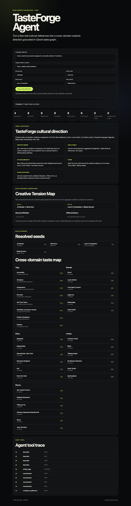

# TasteForge live demo artifact

The Qloo hackathon submission guide asks for a redacted request-to-result explanation, including entity choices, provenance, and known limitations.

## Verified live run

A real production Qloo run completed successfully on **2026-10-06** against:

https://babydov-tasteforge-agent.vercel.app

Input:

- objective: quiet-luxury launch campaign for a cinematic mobile LUT collection;
- market: Tokyo + global creative audience;
- Jil Sander — `brand`;
- Brian Eno — `artist`;
- Lost in Translation — `movie`;
- Blade Runner — `movie`.

Observed production result:

- all **4/4 typed seeds resolved**;
- **10 official Qloo workflow steps** recorded;
- `describe`: 4/4 successful;
- `entity_tags`: successful after one transparent retry of a transient Qloo 429;
- `recommend`: brand / movie / artist / place all successful, 6 results each;
- `compare_audiences`: successful;
- Creative Tension Map: available;
- public UI completed with `Complete. 10 agent steps recorded.`.

Durable evidence:

- redacted workflow artifact: `artifacts/qloo-live-demo.json`;
- deployment receipt: `artifacts/deployment.json`;
- result-state screenshot: `docs/tasteforge-live-result.png`.



## Reproduce

Keep the Qloo key only in the server/local environment:

```bash
export QLOO_API_KEY=...
export QLOO_BASE_URL=https://hackathon.api.qloo.com
export QLOO_TRUSTED_BASE_URL=https://hackathon.api.qloo.com
npm run verify:qloo
npm run demo:live -- artifacts/qloo-live-demo.json
```

The live-demo script uses explicit Qloo entity types for the default judge flow so the four cultural references are resolved deterministically.

## What is included

The artifact allowlists:

- campaign objective, market context, and up to four cultural seed names;
- harness / workflow-contract / result-schema versions;
- normalized Qloo seed and cross-domain evidence;
- TasteForge creative brief;
- workflow operation names and statuses;
- correlation IDs, durations, warnings, retry counts, and provenance.

## What is excluded

The builder never copies arbitrary request/result objects. It does not include:

- environment variables;
- Authorization or x-api-key headers;
- Qloo credentials;
- raw executor internals outside the allowlist.

A regression test injects credential-shaped fields at multiple levels and asserts they are absent from the serialized artifact.

## Final gate

The strict submission gate now passes:

```bash
npm run submission:strict
```

Result: `ready=true` with the live Qloo artifact, verified external deployment, and demo media all present.
